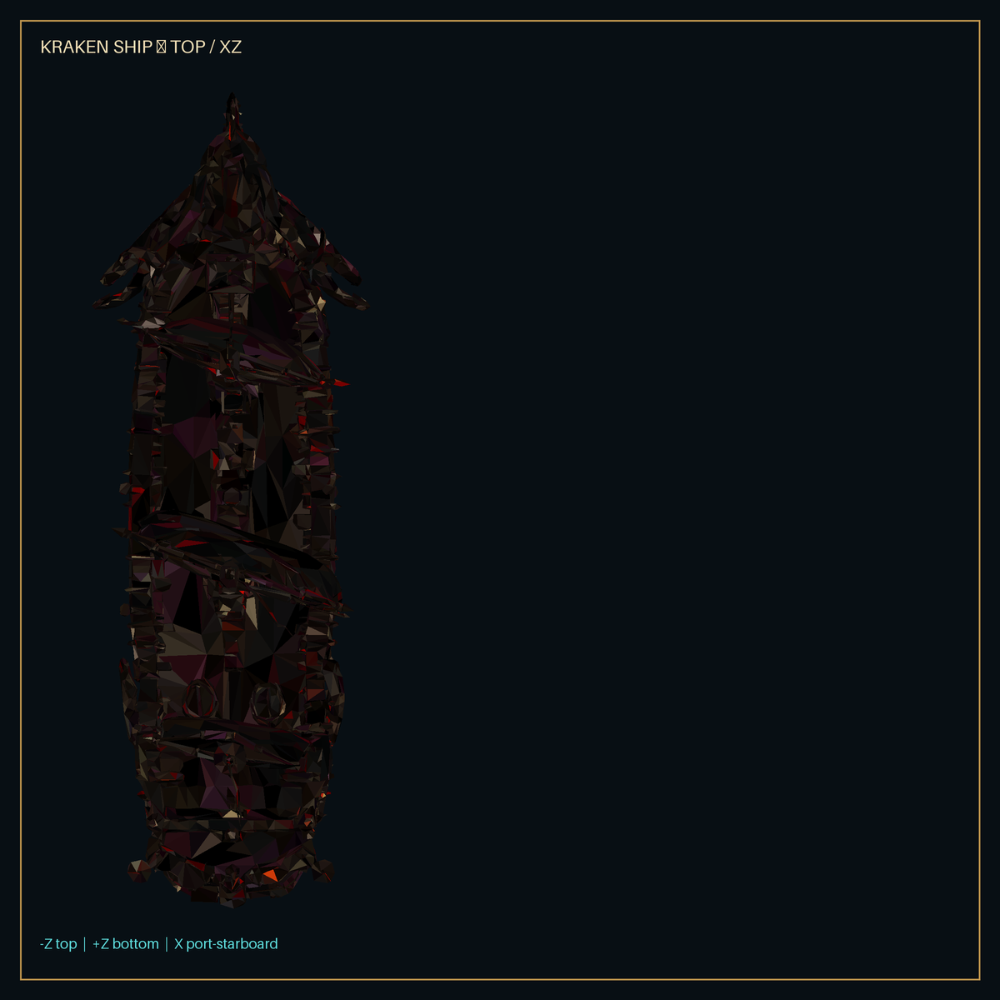
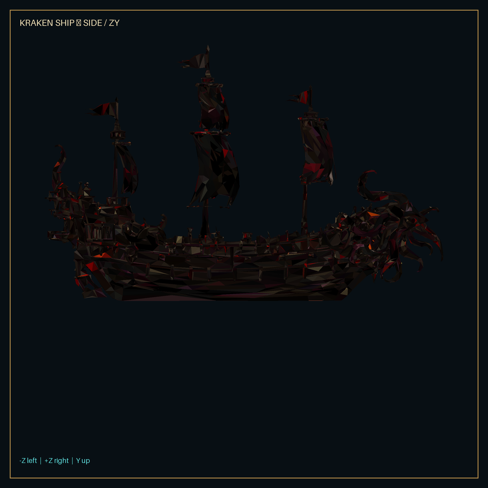

# Abyssal Dominion V20.1 - Kraken Player Ship Integration

## Scope

V20.1 replaces only the visual representation of the Sovereign player ship. Movement, turning, collision, combat, targeting, progression, save data, map travel, respawn, touch input and zoom retain the V20 logic.

## Asset Analysis

Source: `Kraken_ship_player_30k.glb`

| Property | Result |
| --- | --- |
| File size | 21,394,148 bytes |
| Format | glTF 2.0 binary |
| Scene hierarchy | One node (`output_unwrapped`), one mesh |
| Geometry | 30,744 triangles, 53,674 vertices |
| Draw calls | 1 primitive / 1 draw call |
| Materials | 1 opaque, double-sided metallic-roughness material |
| Attributes | Normals and UV0 present |
| Animation / skin | None |
| Bounds | min `(-0.3416, -0.6419, -1.0000)`, max `(0.3417, 0.6425, 0.9989)` |
| Axes | +Y up, bow points +Z |
| Textures | 2048x2048 base color PNG, 4096x4096 metallic-roughness PNG |

The model is centered close to its origin. A single documented visual rotation maps its +Z bow to the game's +X forward direction. No heading or movement code is changed.

Technical source projections used for orientation and waterline review:

## Final Visual Configuration

- Asset path: `/assets/3d/ships/player/kraken/Kraken_ship_player_30k.glb`
- Uniform scale: `48`
- Rotation offset: `+PI / 2` around Y
- Waterline offset: `+22.5` world units
- Resulting visual dimensions: approximately `96 x 62 x 33` world units (length x height x beam after orientation)
- Wake attachment: `forward -50`, `lateral 0`
- Port/starboard visual cannon rows: forward `-18, 0, +18`, lateral `+/-17`, height `10`

`ShipVisualDefinition` stores only presentation data. It is reusable for later player ship designs and intentionally contains no gameplay values.

## Loading And Fallback

The renderer loads the exact provided Kraken GLB for the Sovereign ship. Failure follows this chain:

1. V20 Sovereign Frigate GLB LOD set
2. Existing procedural player ship

The old assets and code remain in the project. A failed network request, malformed GLB or material problem therefore does not remove the player ship.

## Water And Combat Attachments

Wake sampling uses the configured stern offset transformed by the unchanged player heading. It no longer assumes the dimensions of the old model.

Gameplay projectile origins remain unchanged. Only the short-lived player muzzle flash is placed on the configured port or starboard visual hardpoint. Hits, misses, timing, damage and water splashes still use V20 combat data.

## Material Adjustments

The embedded Meshy textures remain the visual source. At runtime each imported material is cloned before conservative tuning:

- Base color texture uses sRGB color space.
- Roughness is clamped to at least `0.68`.
- Metalness is clamped to at most `0.55`.
- Environment intensity is set to `0.72`.
- Mipmaps, linear mip filtering and up to 8x anisotropy are enabled.
- Cast and receive shadows are enabled by the visual definition.

This reduces plastic-like highlights without destructively changing the GLB.

## Visual Debug

Development builds accept `?shipDebug=1`. It displays the imported bounds, local axes, waterline, wake origin and cannon hardpoints. Production builds never enable these helpers.

## Visual Acceptance

The source asset was inspected with deterministic top and side projection renders to establish bow, stern, bounds and waterline before integration. The integrated cloud browser preview loaded the application shell, controls and error fallback, but its sandbox reports `GL_RENDERER = Disabled` and cannot create a WebGL context. Consequently the zoom/style observations below are configuration- and source-asset acceptance; final in-engine screenshots and FPS remain a real-device acceptance item.

- **Tactical:** The long hull, raised sails and red Kraken accents preserve a distinct silhouette. Small texture detail is intentionally secondary.
- **Combat:** At roughly 96 world units long the ship is slightly more prominent than common NPC ships without dominating the map. This is the primary evaluation scale.
- **Close:** Deck, sail, bow and hull texture detail become visible while the camera remains fixed-oblique 2.5D.
- **Waterline:** The offset places the lower keel below the water plane and keeps the deck and sails above it.
- **Wake:** The configured origin sits just behind the approximately 48-unit half-length stern.
- **Combat:** Muzzle flashes use visual broadside hardpoints while gameplay projectiles remain regression-safe.
- **Style:** The black/red adult fantasy design fits the Abyssal direction. It may need a future authored material pass to improve mid-distance value separation.

## Performance

One draw call and 30.7K triangles are reasonable for one hero ship. The primary mobile risk is texture memory and transfer size, especially the 4096x4096 metallic-roughness PNG. Decoded RGBA textures with mipmaps can require roughly 107 MB combined before engine-specific optimization. V20.1 deliberately preserves the supplied textures for a fair asset test.

The production build and automated checks establish loader/path integrity. Integrated GPU FPS must still be profiled on representative Android and iOS hardware; a CI/browser environment is not a substitute for device measurement.

## Verification Results

- TypeScript: passed
- ESLint: passed
- Architecture tests: 6/6 passed
- Full build and test suite: 7/7 passed
- Production artifact validation: passed
- Built Kraken GLB: present with exact source size of 21,394,148 bytes
- Browser shell and responsive UI: loaded in agent preview
- Browser WebGL render: unavailable because the cloud browser disables WebGL
- Physical Android/iOS FPS and texture-memory profiling: open

## Recommendation For V21

Keep 30K as the combat/high-quality model if device profiling is stable. Add the 10K asset for tactical zoom and LOW/MEDIUM mobile tiers. Reserve 100K for shipyard inspection or optional high-end close presentation only if an A/B comparison shows a meaningful improvement. Before introducing LOD switching, export mobile textures as KTX2/Basis and reduce the metallic-roughness source to 2048 where the visual loss is negligible.
